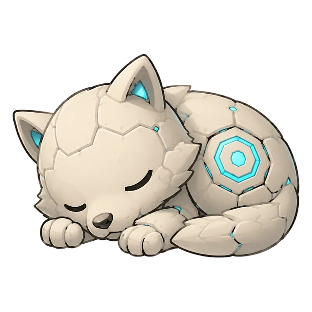
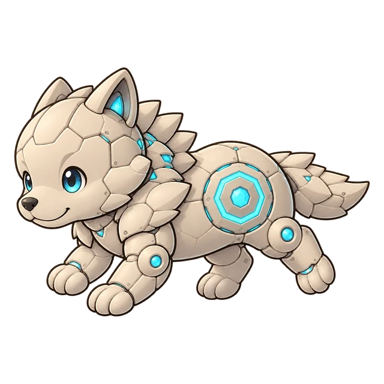
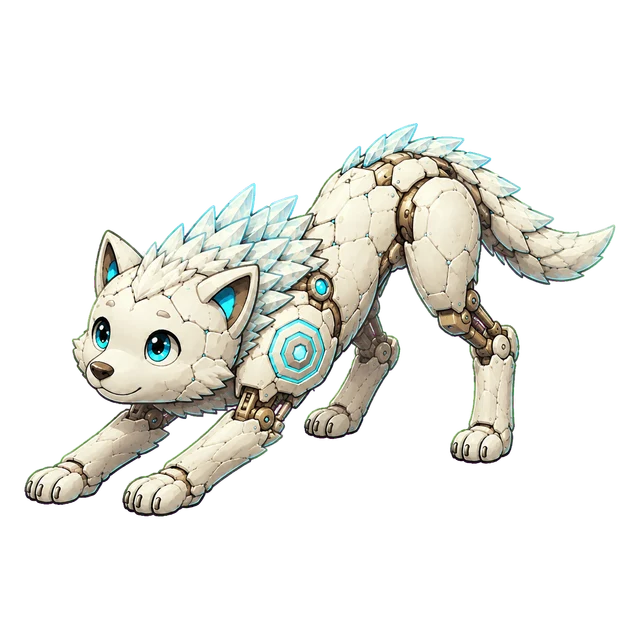
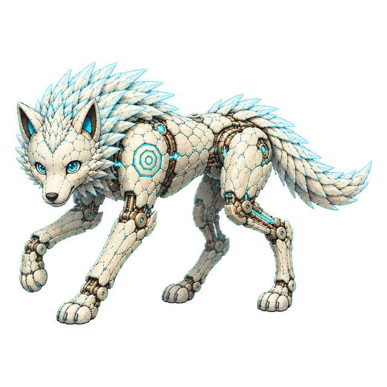
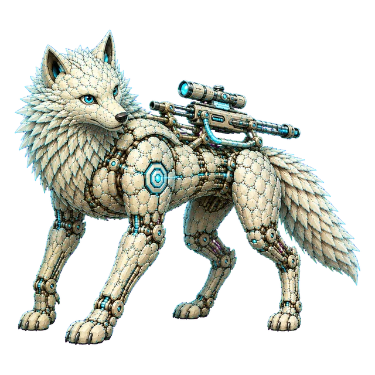
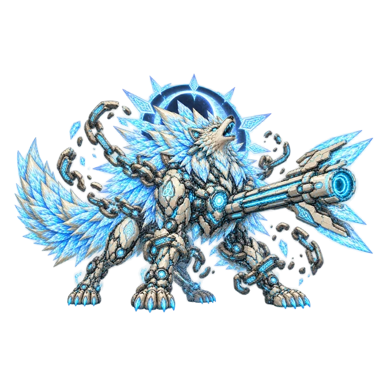
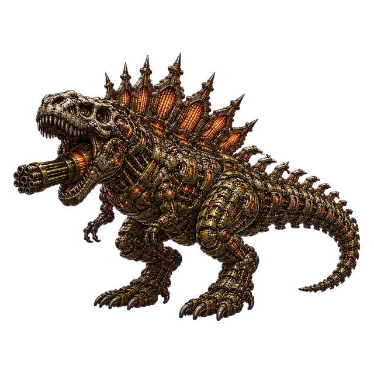
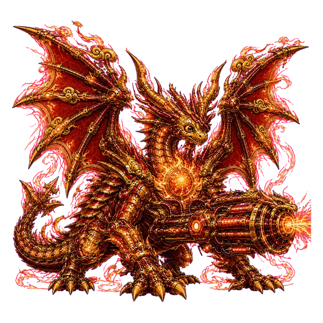
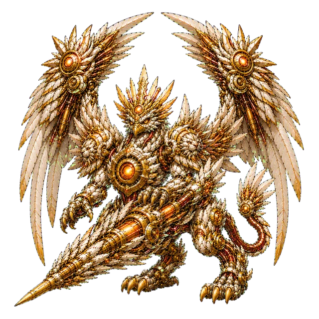
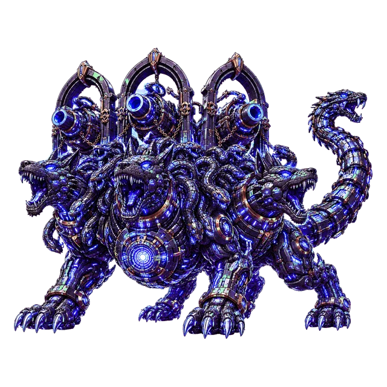

<div align="center">

# Tokenmon

**Your Claude Code usage is a creature now. Feed it tokens.**

Every project you code with Claude hatches its own mecha critter — and it evolves through
**20 illustrated stages** as you burn real tokens.

&nbsp;➜&nbsp;&nbsp;➜&nbsp;&nbsp;➜&nbsp;&nbsp;➜&nbsp;&nbsp;➜&nbsp;

*WolfBot, Lv.1 → Lv.20. There are 59 more.*

    

*…including rare dinos and mythics, if your project name rolls lucky.*

  

</div>

---

## Why

You already paid for those tokens. `ccusage` tells you the numbers — Tokenmon makes you **feel** them:

- 🍚 Your 5-hour and weekly rate limits become **bowls of food that evaporate at reset**. Unused capacity isn't savings, it's waste — the dashboard says so to your face.
- 🐺 Every project folder is a **pet you're raising**. Heavy grind week? Visible armor upgrades. Abandoned side project? It's starving and you can see it wilt.
- 🔥 Your GitHub-grass instincts, weaponized: **daily streaks**, hatch moments, and a Lv.20 crown that takes literal billions of tokens.

All of it runs **100% locally**. No account, no server, no telemetry. Your conversations are never read for content — numbers only.

## Quick start

```bash
git clone https://github.com/aa1192sh1013-ctrl/tokenmon.git
cd tokenmon
npm install
npm run setup     # hooks the collector into ~/.claude (your settings are backed up)
npm run dev       # → http://localhost:4242
```

Open any Claude Code session, do anything, and your first critter hatches within seconds.

**Been using Claude Code for months?** On first launch Tokenmon automatically backfills your lifetime stats (total tokens, active days, streak) from local transcripts — numbers only. Your history fills the stats board immediately.

Your **critters** are different, on purpose: history doesn't level them. The moment Tokenmon first sees a project, that instant becomes its zero point — it hatches at Lv.1 and grows only from tokens burned after that. Everyone raises theirs from scratch.

## The game

### Leveling

**1 XP = 1,000,000 total tokens** (input + cache + output — the same unit as `ccusage`'s totals). The curve is front-loaded so your first evolutions land within your first sessions, then stretches into a long endgame:

| Level | 2 | 5 | 10 | 15 | 👑 20 (MAX) |
|---|---|---|---|---|---|
| Cumulative XP | 8 | 52 | 350 | 1,650 | **5,700** |
| ≈ total tokens | 8M | 52M | 350M | 1.65B | **5.7B** |

Lv.20 is calibrated against real usage data from a certifiable daily heavy user: **months of hard grinding on a single project**. Wear the crown proudly.

### The species gacha

Your project's **name** deterministically rolls one of 60 species and one of 12 colors (separate rolls — same species, different look). No rerolls. Renaming the folder to reroll is between you and your conscience.

| Tier | Species | Odds each |
|---|---|---|
| Common (50) | wolf, fox, cat, tiger, panda, eagle, owl, shark, orca, whale, octopus, crab, mantis, scorpion, butterfly… | 1.8% |
| Dino ✨RARE (5) | Tyranno · Tricera · Raptor · Ankylo · Ptera | 1.2% |
| Mythic ✨RARE (5) | Dragon · Phoenix · Griffin · Qilin · Cerberus | 0.8% |

Browse them all (every species, every stage) in the built-in **Dex** at `/gallery`.

### Loss aversion, not guilt

- 🍚 **Bowls**: the 5h window and weekly feeder show *% eaten*, when the rest **evaporates**, and a countdown. Clean your bowl for the gold "digested" state.
- 🥀 **Starving**: leave a project untouched for 3+ days and its critter starts wilting — XP withers ~3%/day and levels can drop. One session restores everything. Nothing is ever lost permanently; it just looks sad enough to make you open the terminal.
- 🔥 **Streaks**: one bite a day keeps the flame. Your backfilled history counts.

## How it works

```
Claude Code ──(statusline JSON: per-session tokens, cost, model)──▶ tiny local collector
Claude transcripts ──(usage numbers only, tailed live)────────────▶ ~/.claude/tokenmon/
Anthropic usage API ──(your own OAuth token, same as the app)─────▶ live rate-limit bowls
                                          │
                                          ▼
                          Next.js dashboard on localhost:4242
```

- The collector is a dependency-free Node script chained into your [status line](https://code.claude.com/docs/en/statusline) — if you already have one, it keeps rendering untouched.
- Rate-limit gauges query the **same usage endpoint the Claude desktop app uses**, authorized by the OAuth token Claude Code already stores on your machine. Traffic goes only machine → Anthropic. Falls back to statusline observations, then a transcript-based estimate.
- Sessions without a statusline (e.g. the desktop app) are picked up by tailing transcript **usage numbers** incrementally.

## Privacy

Worth repeating: **nothing leaves your machine** except the usage-gauge call to Anthropic itself, made with your own token. Conversation content is never read into any Tokenmon file — collectors and backfill aggregate token counts and timestamps, period. Opt out of even the usage call with `{ "useUsageApi": false }` in `~/.claude/tokenmon/config.json`.

## Nice to know

- **English & Korean** UI — auto-detected from your browser, forceable with `?lang=en|ko` or `{ "lang": "ko" }` in the config.
- **Keep the ranch tidy**: home/Desktop/Downloads/temp folders never hatch critters. Exclude more by name: `{ "ignoreProjects": ["_*", "*-sandbox"] }`.
- **Full ranch reset**: delete `~/.claude/tokenmon/projects.json` — every critter re-hatches at Lv.1 from that moment.
- **Desktop widget mode**:
  ```bash
  # Windows (Edge)                          # macOS (Chrome)
  start msedge --app=http://localhost:4242
  open -na "Google Chrome" --args --app=http://localhost:4242
  ```
- **macOS note**: if Claude Code keeps its OAuth token in the Keychain (no `~/.claude/.credentials.json`), the bowls use the statusline/estimate fallback. Everything else works identically.
- **API-key users**: no subscription rate limits → bowls stay idle; critters, tokens, and charts all work.

## Uninstall

```bash
npm run remove            # restores your original statusline (timestamped settings backups kept)
npm run remove -- --purge # …and deletes collected snapshots too
```

## 한국어

Claude Code 사용량으로 키우는 메카 동물 다마고치예요. 프로젝트 폴더마다 한 마리씩 부화해서(60종 × 12색 랜덤, 프로젝트명으로 결정) 총 토큰 100만 개당 1 XP로 20단계 일러스트 진화를 합니다. 5시간 밥그릇을 안 비우면 증발하고, 3일 방치하면 굶고, 매일 쓰면 스트릭이 쌓여요. 전부 로컬에서만 돌고 대화 내용은 절대 수집하지 않습니다. UI는 브라우저가 한국어면 자동으로 한국어. `npm run setup` 한 번이면 연결 끝!

## License

MIT © Sunhong Min

---

<div align="center">

*If your critter made you open one more terminal today, consider a ⭐ — it feeds the dev.*

</div>
